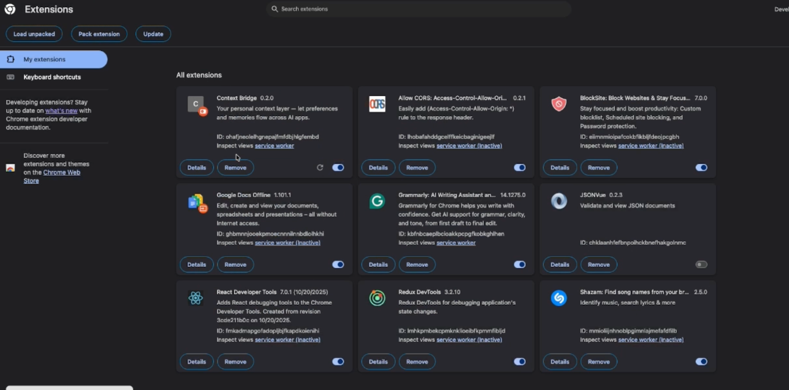
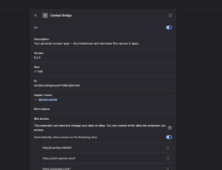
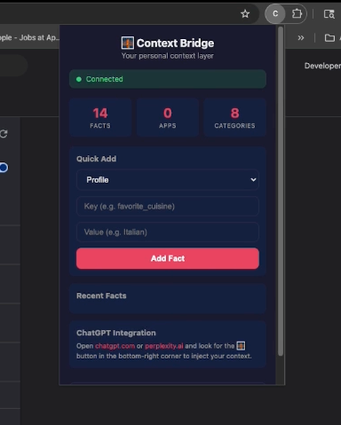
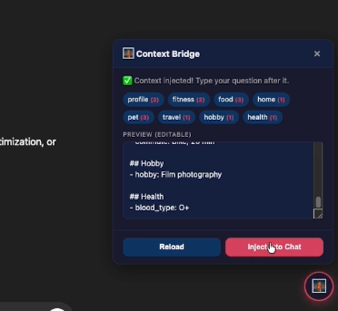
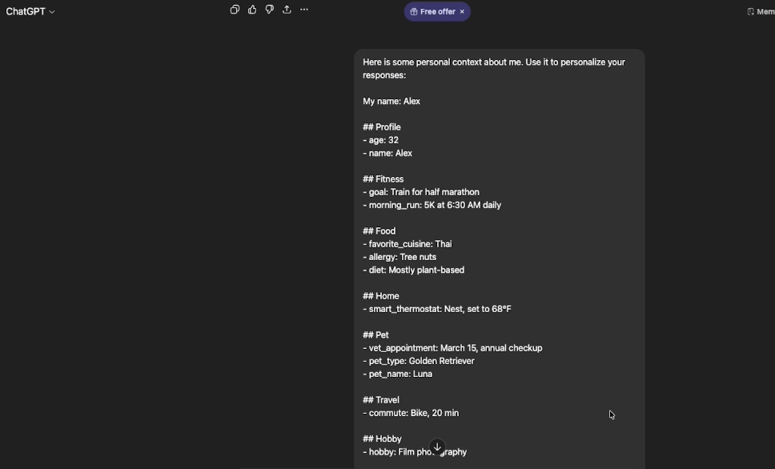
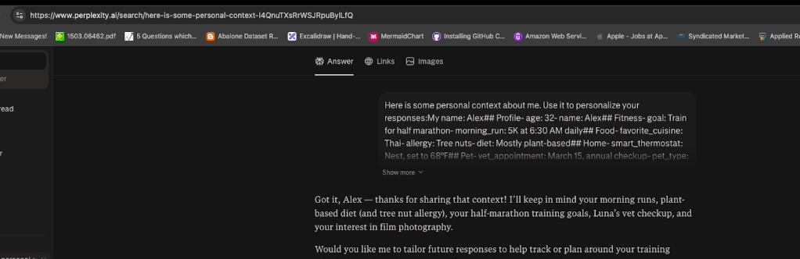

# Context Bridge

**SSO made identity portable. Context Bridge makes *you* portable.**

> A personal, user-owned context layer that lets your preferences, memory, and life context flow seamlessly across every AI app you use — without re-explaining yourself.

---

## The Problem

Every time you open a different AI app, you start from scratch.

```
2010: "Why do I need a different password for every website?"  → SSO solved this
2026: "Why do I need to re-explain my life to every AI app?"  → Context Bridge solves this
```

**You are the copy-paste middleware between your AI tools.** Context Bridge eliminates that.

---

## How It Works

```
         WITHOUT Context Bridge                  WITH Context Bridge

    ┌───────┐                             ┌───────┐
    │  You  │                             │  You  │
    └───┬───┘                             └───┬───┘
        │                                     │
   Re-type everything                     Context flows
   into every app                         automatically
        │                                     │
   ┌────┼────┬────┬────┐              ┌───────▼───────┐
   ▼    ▼    ▼    ▼    ▼              │ Context Bridge│
  AI1  AI2  AI3  AI4  AI5             └───────┬───────┘
  (each starts from zero)                     │
                                    ┌────┬────┼────┬────┐
                                    ▼    ▼    ▼    ▼    ▼
                                   AI1  AI2  AI3  AI4  AI5
                                   (each knows your context)
```

---

## Demo

> **Video walkthrough:** [context-bridge-demo.mp4](docs/demo/context-bridge-demo.mp4)

### 1. Install the Extension

Navigate to `chrome://extensions`, enable **Developer mode**, and load the unpacked `extension/` folder.



### 2. Enable Context Bridge

View the extension details and enable it.



### 3. Connect to Your API

Click the 🌉 extension icon — the popup shows **Connected** status with your context stats.



### 4. Use on ChatGPT

Open [chatgpt.com](https://chatgpt.com). Click the floating 🌉 button → **Load Context** → **Inject to Chat** to paste your personal context directly into the chat input.



### 5. Context Loaded in ChatGPT

Your personal context (profile, fitness, food preferences, etc.) is injected into the ChatGPT text area — ready to send.



### 6. Works on Perplexity AI Too

Same flow on [perplexity.ai](https://www.perplexity.ai) — the 🌉 button loads and injects your context seamlessly.



---

## Cross-Domain Context

Each AI app is an island. Context Bridge connects your life domains:

| Connection | What Happens |
|------------|-------------|
| 🏃 Fitness → 🍽️ Food | Long run Saturday → extra carbs Friday dinner |
| 🐕 Pet → 🏃 Fitness | Dog can't run → plan solo routes this week |
| 💰 Finance → 🏠 Home | Budget tight in March → delay reno to May |
| 👨‍👩‍👧 Family → 🍽️ Food | Kid starts school → pack-friendly lunches |
| 🏃 Fitness → 💰 Finance | Need new shoes → $160 in March budget |

---

## Privacy by Design

| Principle | Detail |
|-----------|--------|
| **Your data, your control** | You own 100% of your context. |
| **Consent per app** | Each AI app gets only the categories you approve. |
| **Sensitivity levels** | Critical data (health, finance) never shared without explicit consent. |
| **Full audit trail** | Every access logged — who read what, when. |
| **Delete anytime** | One call — immediate and permanent. |
| **Personal only** | For your personal life. Not your employer's. |

---

## Architecture

```
┌──────────────┐  ┌──────────────┐  ┌──────────────┐
│   Browser    │  │   Provider   │  │   Provider   │
│  Extension   │  │  (Fitness)   │  │  (Meals)     │
└──────┬───────┘  └──────┬───────┘  └──────┬───────┘
       │                 │                 │
       └─────────────────┼─────────────────┘
                         │
                 ┌───────▼───────┐
                 │    FastAPI    │  ← REST API
                 │  + Protocol  │  ← JWT auth, consent
                 └───────┬───────┘
                         │
                 ┌───────▼───────┐
                 │Context Broker │  ← Consent enforcement
                 └───────┬───────┘
                         │
          ┌──────────────┼──────────────┐
          ▼              ▼              ▼
    ContextService  UserService   ConsentService
          │              │              │
          ▼              ▼              ▼
    ┌─────────────────────────────────────┐
    │     Storage Port (abstract)         │
    └──────────┬──────────────┬───────────┘
               ▼              ▼
          In-Memory      Azure Cosmos DB
          (dev/test)     (production)
```

Built with **Clean Architecture** and **SOLID principles** — storage is swappable, services depend on abstractions, each layer has a single responsibility.

---

## Context Categories

| Category | Examples |
|----------|---------|
| 👤 Profile | Name, location, timezone, language |
| 🏃 Fitness | Training plans, goals, metrics |
| 👨‍👩‍👧 Family | Members, preferences, events |
| 🍽️ Food | Diet, allergies, favorite cuisines |
| 🏠 Home | Property, maintenance, smart devices |
| 🐕 Pet | Pet health, vet info, schedules |
| 💰 Finance | Budget, savings goals |
| ✈️ Travel | Commute, trip preferences |
| 🎨 Hobby | Hobbies, projects, interests |
| 🏥 Health | Medical info (high sensitivity) |

---

## Quick Start

### Prerequisites

- Python 3.9+
- pip

### Setup

```bash
# Clone
git clone https://github.com/your-username/context-bridge.git
cd context-bridge

# Create virtual environment
python3 -m venv .venv
source .venv/bin/activate

# Install
pip install -e ".[dev]"

# Copy env config
cp .env.example .env
```

### Run the Demo

```bash
python samples/demo.py
```

This runs "Alex's Day" — creates a user, adds personal context, registers an AI app, grants consent, and shows how the app only sees what it's allowed to.

### Start the API

```bash
# Development (in-memory storage)
uvicorn context_bridge.main:app --reload

# Or directly
python -m context_bridge.main
```

API docs at **http://localhost:8000/docs** (Swagger UI).

### Run Tests

```bash
pytest
```

---

## API Overview

| Method | Endpoint | Description |
|--------|----------|-------------|
| `POST` | `/api/v1/users/` | Create user |
| `GET` | `/api/v1/users/{id}` | Get user profile |
| `POST` | `/api/v1/users/{id}/facts/` | Add a context fact |
| `GET` | `/api/v1/users/{id}/facts/` | Query facts (filter by category, sensitivity, tags) |
| `GET` | `/api/v1/users/{id}/facts/snapshots` | Get all category snapshots |
| `POST` | `/api/v1/apps` | Register an AI app |
| `POST` | `/api/v1/users/{id}/consent` | Grant consent to an app |
| `POST` | `/api/v1/users/{id}/token?app_id=` | Issue JWT for app |
| `POST` | `/api/v1/bridge/{id}/read` | App reads context (consent enforced) |
| `POST` | `/api/v1/bridge/{id}/write` | App writes fact (consent enforced) |
| `GET` | `/api/v1/users/{id}/audit` | View audit trail |

---

## Project Structure

```
context-bridge/
├── src/context_bridge/
│   ├── core/
│   │   ├── models/          # Pydantic domain models (context, user, consent)
│   │   ├── ports/           # Abstract interfaces (storage, provider)
│   │   └── services/        # Business logic (context, user, consent)
│   ├── adapters/
│   │   ├── memory/          # In-memory storage (dev/testing)
│   │   └── cosmosdb/        # Azure Cosmos DB storage (production)
│   ├── broker/              # Context Broker — consent-enforced orchestration
│   ├── protocol/            # JWT tokens, auth middleware
│   ├── api/
│   │   ├── app.py           # FastAPI factory
│   │   ├── dependencies.py  # DI container
│   │   └── routes/          # REST endpoints
│   ├── config.py            # pydantic-settings config
│   └── main.py              # Entrypoint
├── extension/               # Chrome MV3 browser extension
├── samples/
│   └── demo.py              # "Alex's Day" end-to-end demo
├── tests/
│   ├── unit/
│   └── integration/
├── pyproject.toml
├── .env.example
└── LICENSE
```

---

## Tech Stack

| Component | Technology |
|-----------|-----------|
| API | FastAPI + Uvicorn |
| Models | Pydantic v2 |
| Auth | JWT (python-jose) |
| Config | pydantic-settings |
| Storage (dev) | In-memory adapters |
| Storage (prod) | Azure Cosmos DB |
| Browser Extension | Chrome Manifest V3 |
| Testing | pytest + pytest-asyncio |
| Linting | Ruff + mypy |

---

## Configuration

Set via environment variables or `.env` file:

| Variable | Default | Description |
|----------|---------|-------------|
| `STORAGE_BACKEND` | `memory` | `memory` or `cosmosdb` |
| `COSMOS_ENDPOINT` | — | Cosmos DB endpoint URL |
| `COSMOS_KEY` | — | Cosmos DB key (or use AAD) |
| `SECRET_KEY` | `change-me-in-production` | JWT signing key |
| `CORS_ORIGINS` | `http://localhost:3000,...` | Allowed CORS origins |

---

## License

MIT

---

*Context Bridge — Because your AI apps should work as a team, not as strangers.*
